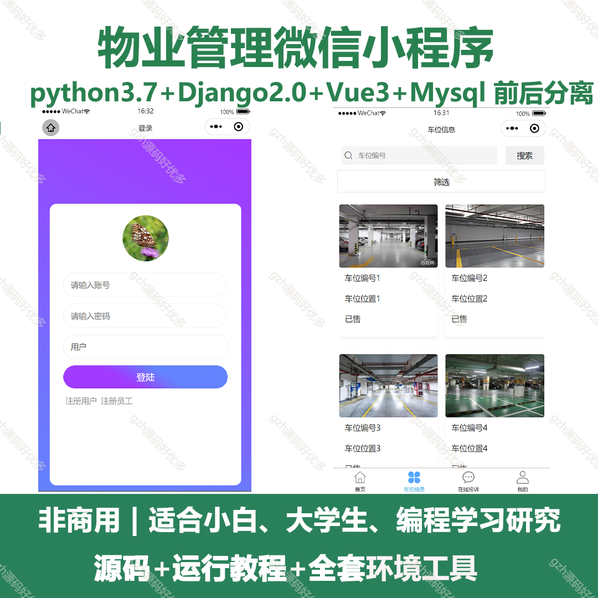
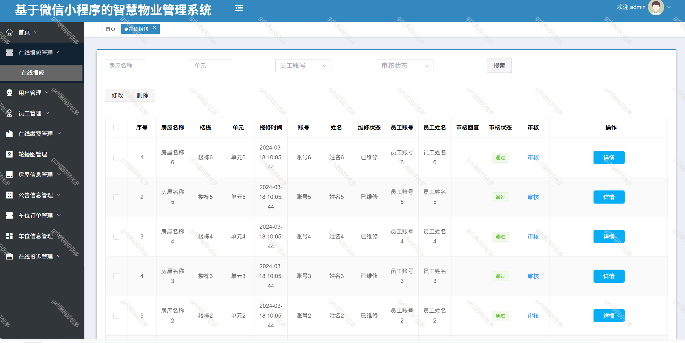
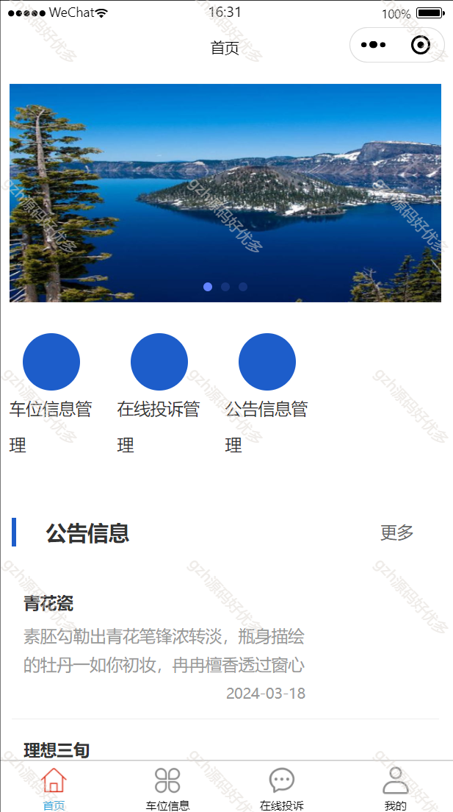
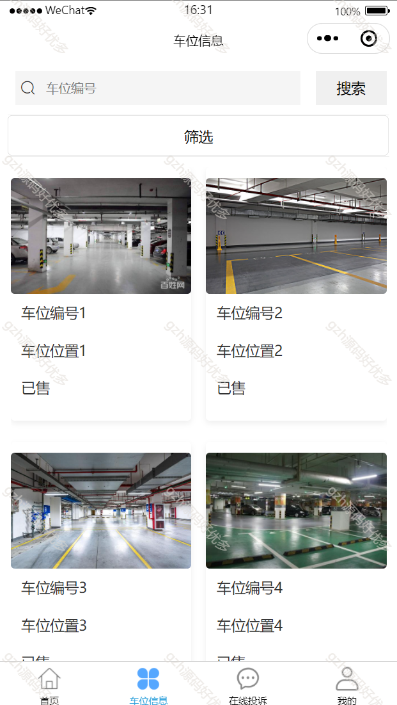
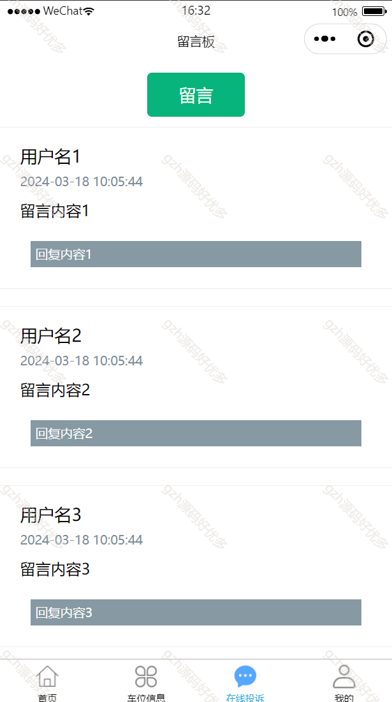
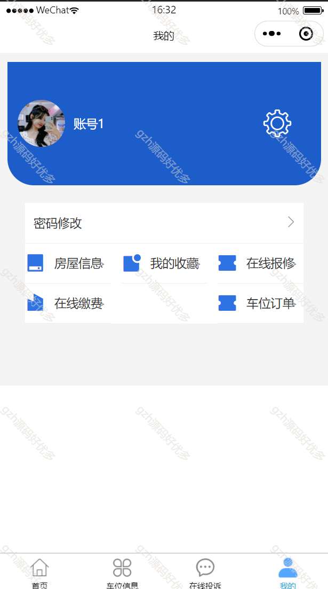
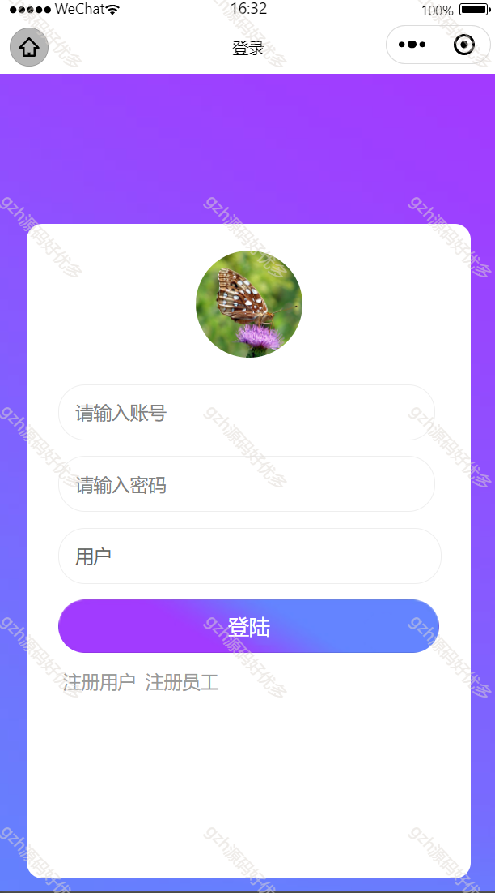
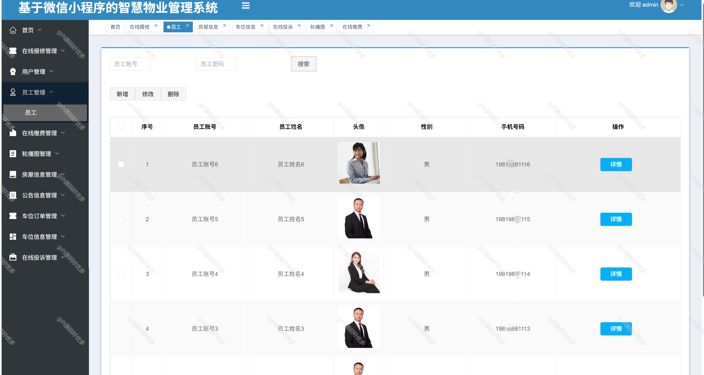
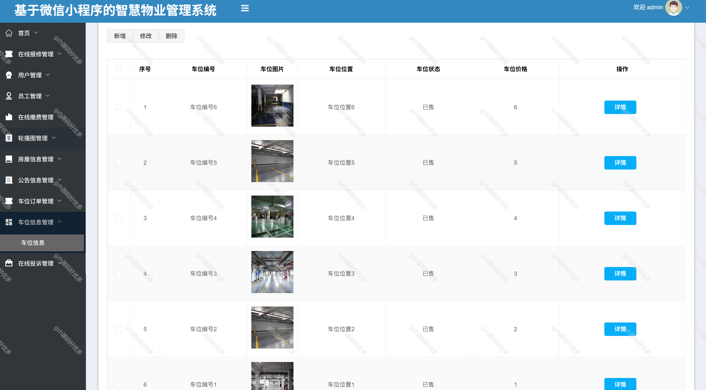

# springbootA382
springbootA382购物商城销售平台
 
## 查看主页获取源码

### 一、关键词

购物商城平台、购物商城销售平台，购物商城系统

 

### 二、作品包含

源码+数据库+万字文档+全套环境和工具资源+部署教程

 

### 三、项目技术

前端技术： vue3 Element Plus Axios Echarts
后端技术：Java、Mysql、SpringBoot2.0、Mybatis

  

 

### 四、运行环境（以下版本亲测，其他版本未知，请自测）

开发工具：IDEA/eclipse  + VSCODE

数据库：MySQL8

数据库管理工具：Navicat10以上版本

环境配置软件： JDK1.8 + Maven3.6.3

前端Nodejs：16

浏览器：谷歌浏览器

 

### 五、项目介绍

项目编号：springbootA382

随着我国经济活力的不断提升和互联网的快速发展，信息的重要性正在显现出来。电子商务作为经济发展的重要一环取得了突飞猛进的发展。由于具有高效便捷的优点，网上购物已经成为一种不可或缺的新型生活方式，近年来各大互联网企业纷纷布局电子商务，获得了巨大成功.

主要功能：
管理员端：用户管理，分类管理，标签管理，订单管理，商品管理，评论管理，通知公告，登录日志，操作日志，错误日志，系统信息，地址管理，积分管理，个人资料，消息管理，优惠券管理，轮播图管理
用户端：轮播图展示，商品分类查询，购物车添加，优惠券领取，商品下单（可使用优惠券），商品评论，收藏/分享/购物车，地址管理，个人资料，消息管理

 

### 六、运行截图

